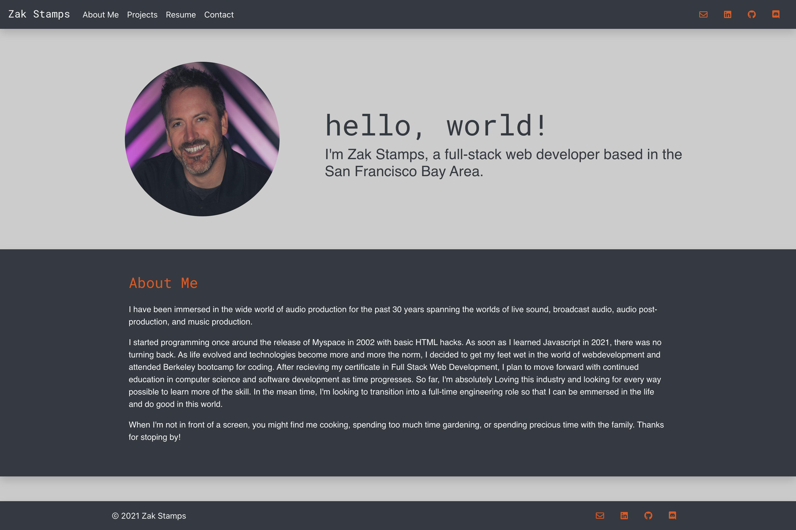
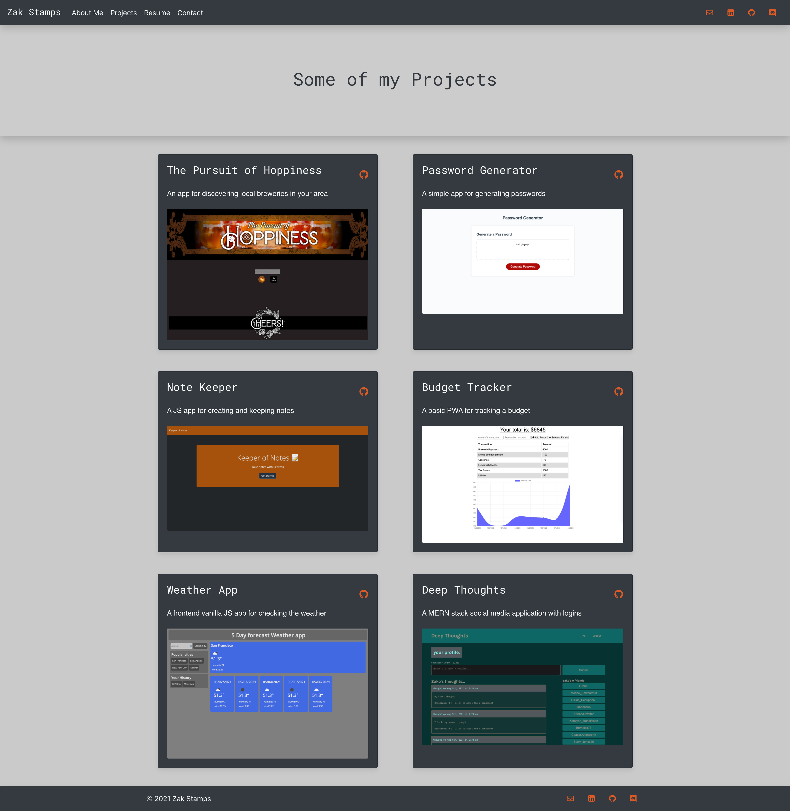
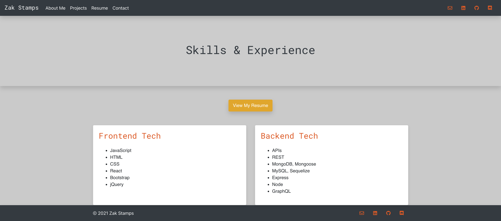
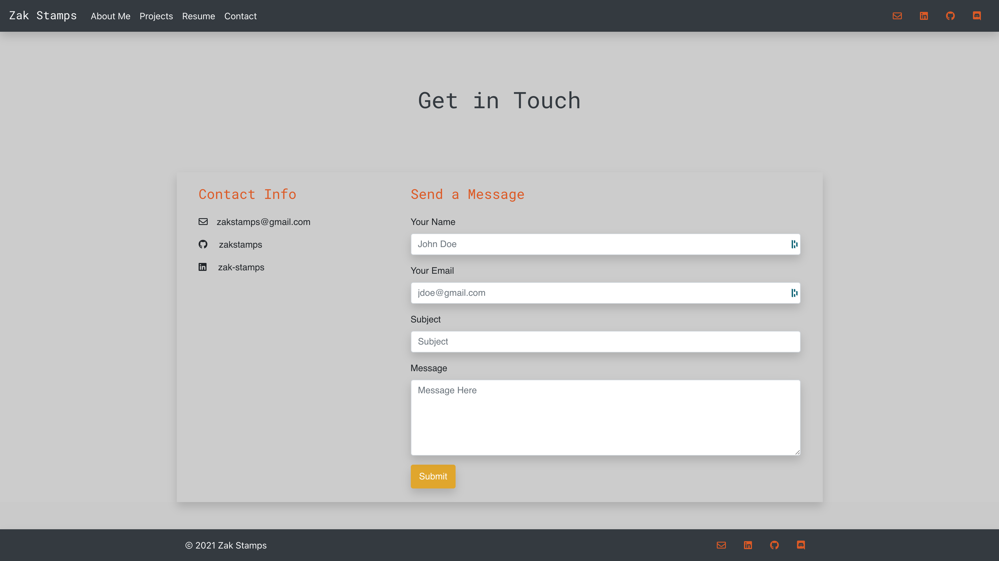

# React Portfolio 
A personal, portfolio used for promoting and showcasing my work as a professional web developer to the world and give examples of past projects, experience and contact information 

## Links

Repo Link: https://github.com/theoneandonlyzako/react-portfolio  
Deployed Link: https://zakstamps.com  

## License
This project is licensed under the Unlicense license.
  

## Table of Contents 
* [Description](#description)
* [Usage](#usage)
* [Packages](#packages)
* [Installation](#installation)
* [Contributing](#contributing)
* [Contact](#contact)
* [Site Example](#example)
  

## Description
A web application built with React to give job recruiters the ability to view my work as a web developer. Built with React, bootstrap, react-dom and Emailjs.  

## Usage
Provides a simple interface for displaying and showcasing my work as a professional web developer when applying for a new job. Or simply an avenue to showoff my latest projects and skills.
 

## Packages
- React
- fontawesome
- bootstrap
- emailjs
- react-dom
- react-router-dom
- react-scripts
- react-typist
  

## Installation
​1. Clone the repo 
2. Install dependencies with `npm -i` 
3. Run `npm start` to run the server and make the API live 
  

## Contributing
​Contributors: Zak Stamps With Lots of help from our trusty 'ol friend Google.
  

## Contact
If you have any questions about the repo, open an issue or contact me directly at theoneandonlyzako@gmail.com or visit my website at zakstamps.com
  

## Example

  
  
  
  
