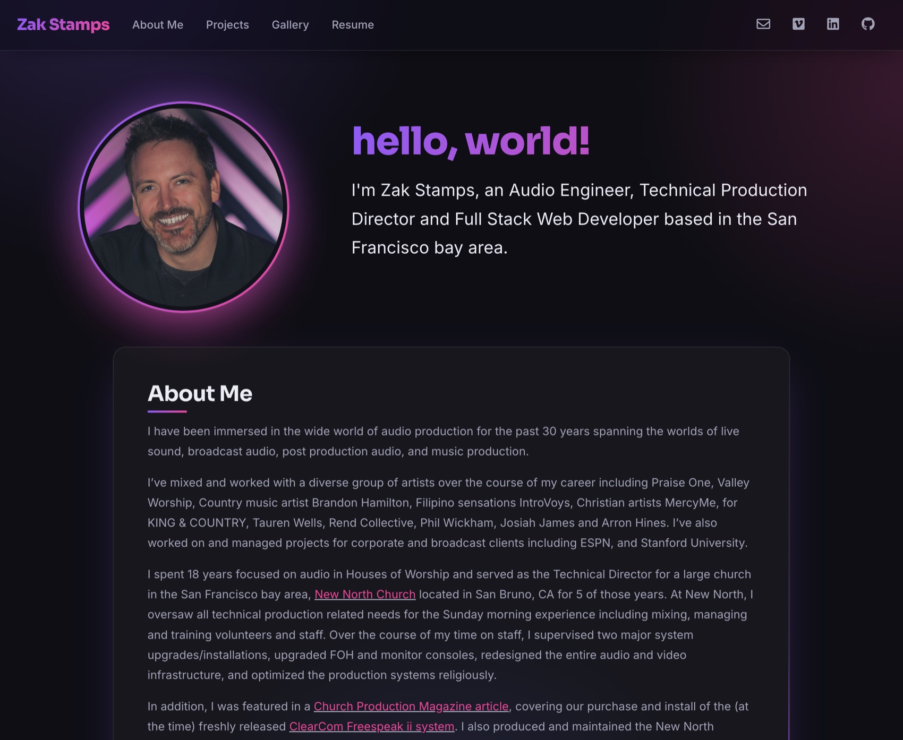
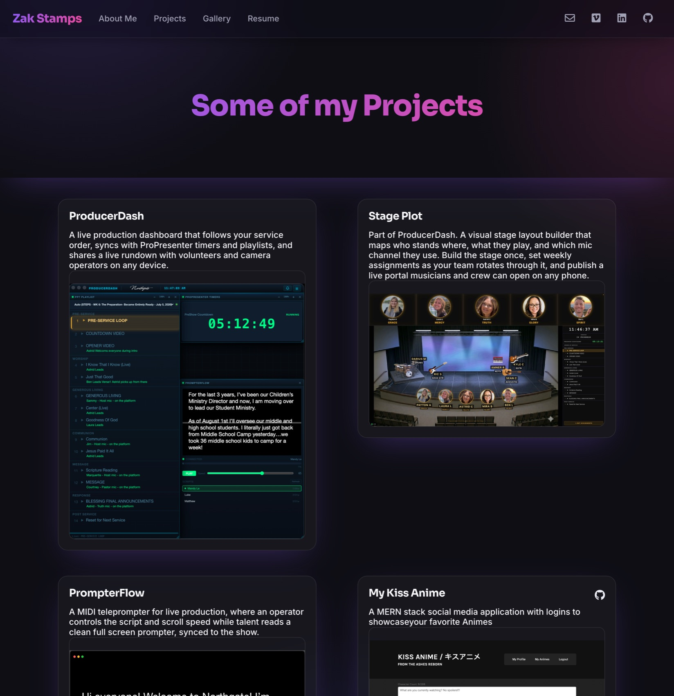
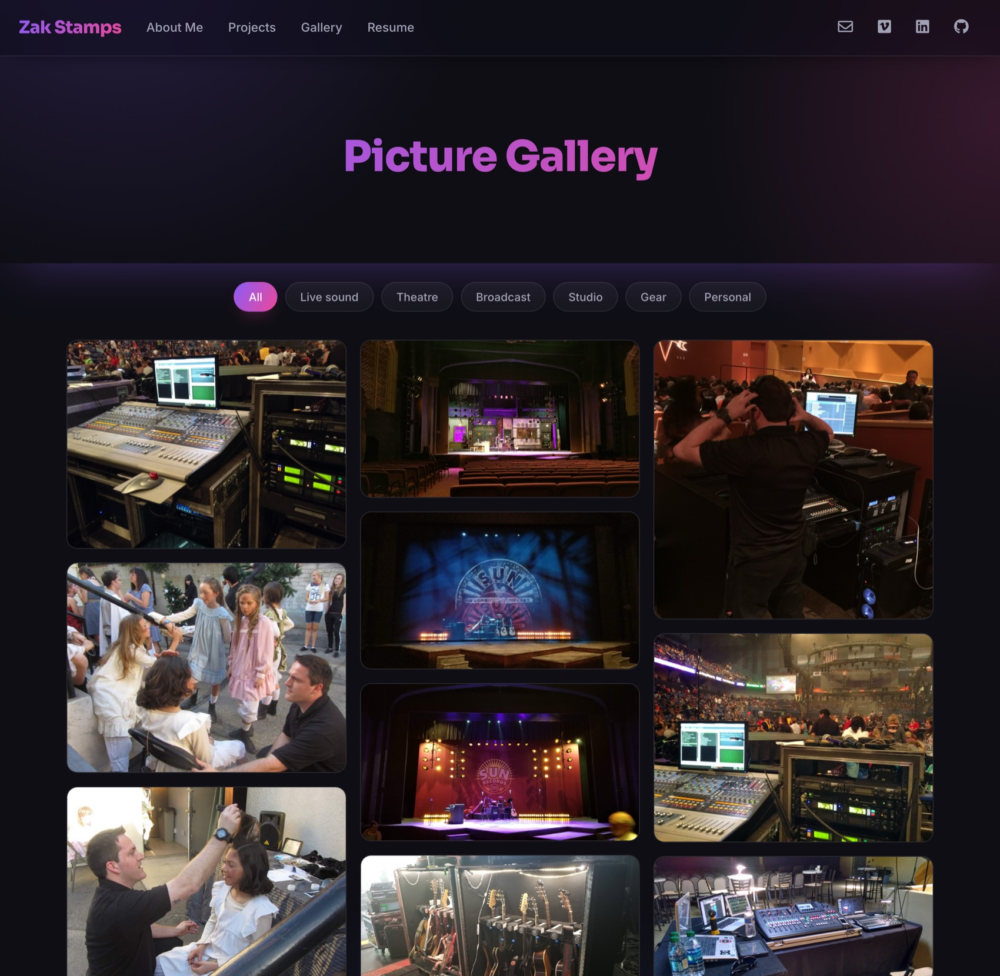
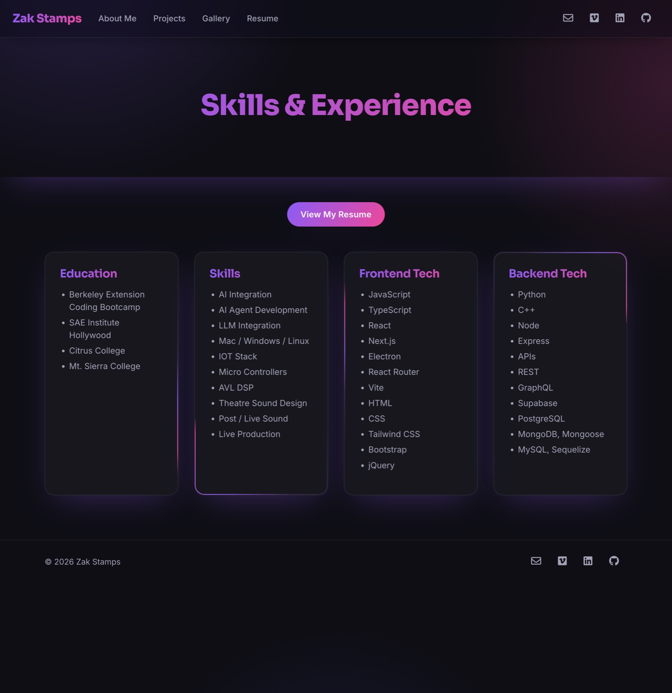

# Zak Stamps Portfolio

The personal portfolio of Zak Stamps: Audio Engineer, Technical Production Director, and Full Stack Web Developer based in the San Francisco Bay Area. It showcases the software I build, a gallery of production work from my career in live and broadcast audio, and my skills and experience.

## Links

- Live site: https://zakstamps.com
- Repo: https://github.com/theoneandonlyzako/react-portfolio

[](http://unlicense.org/)

## Table of Contents

- [About](#about)
- [Features](#features)
- [Built With](#built-with)
- [Running Locally](#running-locally)
- [Deployment](#deployment)
- [Screenshots](#screenshots)
- [License](#license)

## About

A React single page application redesigned around a dark glass aesthetic with a purple to pink gradient theme. It highlights the products I build (the ProducerDash suite), a large photo gallery from my years in live and broadcast production, and an up to date resume.

## Features

- Dark glass gradient design with animated accents
- Animated terminal style intro on load
- Filterable masonry photo gallery with a full screen lightbox and category filters
- Projects showcase featuring the ProducerDash suite (ProducerDash, Stage Plot, PrompterFlow) alongside earlier projects
- Live resume with education, skills, and a modern tech stack, including dynamic experience counters
- Themed auto hiding scrollbar and subtle animated card borders
- Fully responsive across desktop and mobile

## Built With

- React and React Router (HashRouter)
- Bootstrap and React Bootstrap
- react-typist for the intro animation
- OverlayScrollbars for the themed scrollbar
- Font Awesome for icons
- Google Fonts: Sora, Inter, and JetBrains Mono
- Deployed to GitHub Pages via the gh-pages package

## Running Locally

1. Clone the repo
2. Install dependencies: `npm install`
3. Start the dev server: `npm start`

Note: this project uses an older Create React App toolchain. On Node 17 or newer, start it with the legacy OpenSSL provider:

```
NODE_OPTIONS=--openssl-legacy-provider npm start
```

## Deployment

The site is hosted on GitHub Pages with the custom domain zakstamps.com. To build and publish:

```
NODE_OPTIONS=--openssl-legacy-provider npm run deploy
```

This builds the app and pushes the output to the `gh-pages` branch, which serves zakstamps.com.

## Screenshots

### Home and About


### Projects


### Gallery


### Resume


## License

This project is licensed under the Unlicense.
